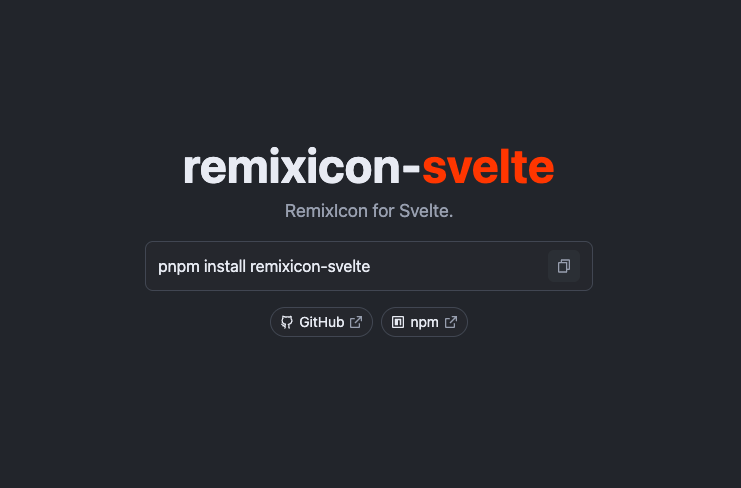

# remixicon-svelte

RemixIcon for Svelte.

```sh
pnpm install remixicon-svelte
```

```svelte
<script>
	import { RiAddFill } from 'remixicon-svelte';
	// or
	import RiAddFill from 'remixicon-svelte/icons/add-fill.svelte';
</script>

<RiAddFill />
```
